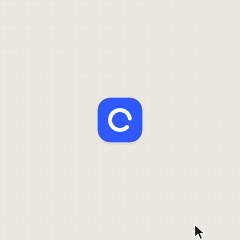
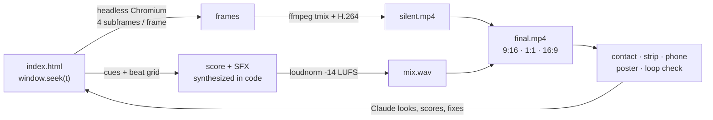
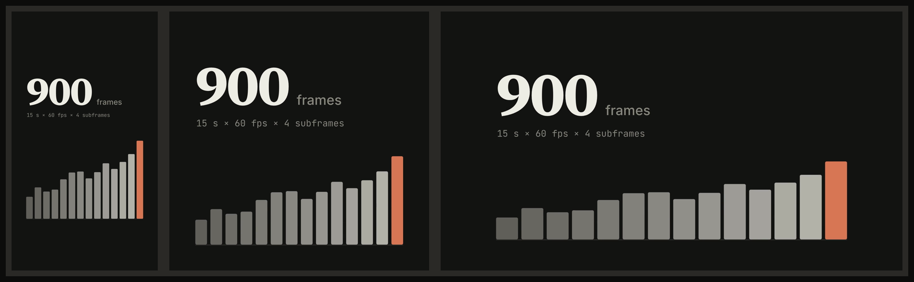
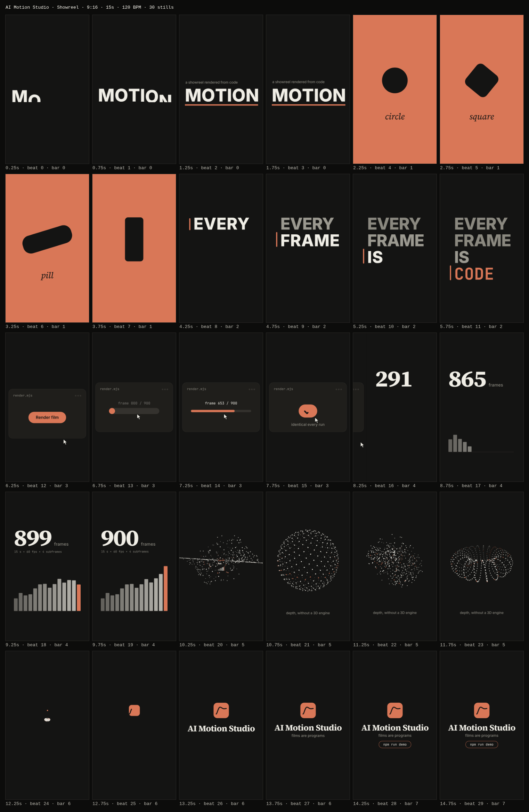

# AI Motion Studio

**A self-contained motion-graphics studio for Claude Code.** Ask for a video in plain English; get back a
rendered MP4 in every format, with an original score, sound effects, and a critique loop in which the model
looks at its own frames until every score is 8/10 or better.

No After Effects, no timeline, no stock music. Every frame is code.

<table>
<tr>
<td width="34%"></td>
<td width="66%"></td>
</tr>
<tr>
<td><b>Showreel</b>: 15 s, 7 shots, 7 techniques.<br><a href="assets/readme/showreel-9x16.mp4">9:16 MP4 with sound</a> · <a href="assets/readme/showreel-16x9.mp4">16:9</a> · <a href="examples/showreel/index.html">source</a></td>
<td><b>UI morph loop</b>: one container, 11 states, seamless 16 s loop.<br><a href="assets/readme/ui-morph-1x1.mp4">1:1 MP4 with sound</a> · <a href="examples/ui-morph/index.html">source</a></td>
</tr>
</table>

> **Want the 5-minute version?** [`motion-studio/`](motion-studio) is the same idea in about 20 files:
> `./install.sh`, then ask your agent for a video. Works with Claude Code, Cursor, Codex and Windsurf.

Both films above were made in this repo with the pipeline it ships, including the soundtracks.
Their critique rounds are in [`examples/showreel/docs/review_log.md`](examples/showreel/docs/review_log.md).

---

## Quick start (3 commands)

You need [Node.js 20+](https://nodejs.org). ffmpeg and a headless browser are installed for you.

```bash
git clone https://github.com/QasimTalkin/Ai-Motion-Studio-.git && cd Ai-Motion-Studio-
npm install
npm run demo
```

About two minutes later you have `examples/showreel/out/9x16/final.mp4` (plus `1x1/` and `16x9/`), with sound.
If anything fails, run `npm run doctor` and it will tell you what's missing.

## Make your own: just ask Claude

Open [Claude Code](https://claude.com/claude-code) in this folder and say what you want:

```
Use the motion studio to make a 15-second vertical video about my coffee shop "Northbound".
Warm, calm, one accent color. Surprise me.
```

```
Make a 20-second launch video for https://your-product.com. Use the real screenshots and logo.
Vertical first, then square and landscape.
```

```
Make a 30-second story video about the history of the bicycle, 1817 to today. Piano score.
```

That's the whole interface. `CLAUDE.md` holds the house rules and the `motion-reel` skill holds the
pipeline, so Claude will:

1. scaffold `films/<name>/` and write a shot list on the beat grid,
2. build the film as one `index.html` using the springs and layout helpers in `lib/`,
3. render one frame per beat, **look at it**, score it, and fix the 3 worst problems (3+ rounds),
4. synthesize the score and SFX, mix to -14 LUFS, render 9:16, 1:1 and 16:9,
5. hand you `final.mp4` for every format, plus a contact sheet, phone test and poster.

For best results start Claude Code at **xhigh** effort for new films (`/model`, then set effort), **max** for a launch
where the first 3 seconds have to carry it, and **medium** for small fixes. Other agents (Codex, Cursor, Gemini CLI)
read the same rules from [`AGENTS.md`](AGENTS.md).

More ready-to-paste prompts, from beginner to overnight productions, are in [`prompts/`](prompts).

---

## How it works

The model can't output video. It writes a **program** that paints any moment on demand, and the studio
does the rest. The prompt is 10% of the video; this harness is the other 90%.



- **Deterministic.** Every frame is a pure function of time, with no timers, no `Math.random` and no carried state.
  A render is identical every run, and a fix is a one-line edit plus a re-render. `npm run check` enforces this.
- **Expensive-feeling motion.** Closed-form springs (`lib/motion.js`) instead of easing curves, with one spring per
  target change (`track()`), so motion stays continuous and you can still render frame 812 directly.
- **Real motion blur.** Each output frame blends 4 subframes across the shutter interval.
- **Sound on the same timeline.** An original score (`pulse`, `piano` or `minimal`) and 11 SFX voices are
  synthesized in code on the beat grid. You can also supply a track and measure it with `studio/beats.py`.
- **Every format from one timeline.** Scenes are laid out in stage units, so each format is reframed, not cropped:



## The critique loop

This habit is what separates the clips that went viral from the ones posted with "it's a bit mid".
`npm run stills` puts one labeled frame per beat on a single sheet in seconds, with no video render needed.
Claude opens it, scores it 1-10 on hook, phone readability, motion, variety, composition, brand and sound
sync, fixes the 3 worst problems, and repeats until everything is 8+.



## Commands

| Command | What it does |
|---|---|
| `npm run demo` | Renders the example showreel end to end |
| `npm run doctor` | Checks Node, ffmpeg, Chromium, optional Python/librosa |
| `npm run new <name> -- --dur 20 --format 9:16` | Scaffolds `films/<name>/` with a starter film and planning docs |
| `npm run preview [film]` | Live preview in your browser: space to play/pause, arrows to scrub, synced audio |
| `npm run check <film>` | House rules as code: banned APIs, determinism, loop seam, dead time |
| `npm run stills <film>` | One frame per beat → `out/stills.png` |
| `npm run film <film> [-- --draft]` | Everything: check → sound → render all formats → mux → sheets |
| `npm run render <film> -- --from 4 --to 6` | Re-render only the seconds you fixed |
| `npm run audio <film>` | Score + SFX → `out/mix.wav` at -14 LUFS, and `out/beats.json` |
| `npm run sheets <film> -- --at 4.2` | Contact sheet, strip, phone test, poster, loop check |

## What's in the box

```
CLAUDE.md / AGENTS.md    house rules every agent reads on every run
lib/motion.js            springs, track(), indicator, swapAlpha, seeded noise, beat pulses, frameHold
lib/stage.js             boot(): formats, fonts, seek(t), layout units, text helpers, live preview
studio/                  render · audio (music, sfx, beats.py) · check · stills · sheets · film · new
templates/film/          what `npm run new` copies: starter film + shot list, style guide, review log
examples/                showreel (L1) and ui-morph (L3), with shot lists and review logs
prompts/                 every prompt from the course, L0 beginner → L4 director's brief
.claude/skills/          motion-reel · critique-pass · director-brief
.claude/agents/          motion-critic · sound-designer · shot-animator (for long productions)
docs/                    COURSE · ENGINE · SOUND · WORKFLOW · RESOURCES
films/                   your work (git-ignored)
```

## Levels

| Level | You bring | Start with |
|---|---|---|
| **L0** | nothing | "make a video about X" ([00-beginner](prompts/00-beginner.md)) |
| **L1** | a test | the one-liner showreel ([01](prompts/01-showreel-one-liner.md)) |
| **L2** | a product URL or a look you love | brand reel ([02](prompts/02-brand-reel.md)), reference ([03](prompts/03-reference.md)) |
| **L3** | a product story | the XML state-list spec ([04](prompts/04-ui-morph-spec.xml)) |
| **L4** | a night and a budget | the director's brief + subagents ([05](prompts/05-director-brief.md)) |

API keys (ElevenLabs for voices, fal for image/video models) go in `.env` (see `.env.example`).
Refer to them by name in prompts and never paste a real key.

## Troubleshooting

- **`npm run doctor` says Chromium is missing:** run `npx playwright install chromium`.
- **Your own ffmpeg:** set `FFMPEG_PATH=/path/to/ffmpeg`. The bundled `ffmpeg-static` build is used otherwise.
- **Measuring a supplied track:** `pip install numpy librosa soundfile`. This is optional; synthesized scores don't need Python.
- **Slow renders:** use `--draft` for pacing passes (540p, 30 fps, no blur) and `--from/--to` to re-render only the seconds you changed.

## Credits

Built from the course *How to build a motion design studio with Opus 5.5* by
[Movez](https://movez.substack.com), and the posts, prompts and repos it collects. See
[`docs/RESOURCES.md`](docs/RESOURCES.md) and [`docs/COURSE.md`](docs/COURSE.md) for how each step maps to this repo.

## License

[MIT](LICENSE). Fonts are SIL OFL (Source Serif 4, Inter, JetBrains Mono).
