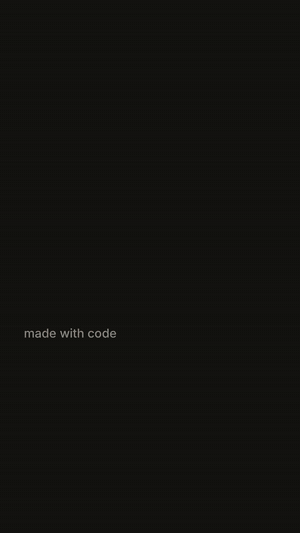
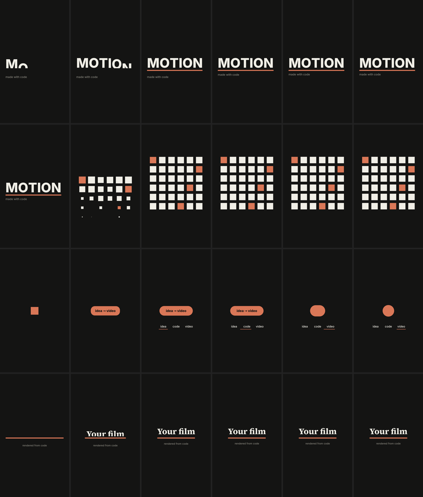

# motion-studio

**The simplest AI motion-graphics studio.** Your coding agent writes one HTML file, and one script turns it into a video with sound.
No After Effects, no timeline, no pipelines.



## Start (2 minutes)

```bash
git clone https://github.com/QasimTalkin/Ai-Motion-Studio-.git
cd Ai-Motion-Studio-/motion-studio
./install.sh            # or: make setup
make demo               # → out/demo/final.mp4
```

Then open **Claude Code, Cursor, Codex or Windsurf** in this folder and say:

> make me a cool 15-second motion design video

That's it. The agent reads `CLAUDE.md` / `AGENTS.md`, follows the one skill, looks at its own frames
until they're good, and hands you `out/<name>/final.mp4`.

<br clear="right">

## Prompt gallery

Copy one from [`prompts/`](prompts), paste it into your agent, and fill in the [brackets].

| Prompt | When | You get |
|---|---|---|
| [showreel](prompts/showreel.txt) | you want to see what it can do | 15 s showreel with sound |
| [product-reel](prompts/product-reel.txt) | you have a product URL | 20 s launch video with your real screenshots |
| [ui-morph](prompts/ui-morph.txt) | your product is an app | one shape morphing through your UI, looping |
| [reference-style](prompts/reference-style.txt) | you love another video's look | your video in that style |
| [director-brief](prompts/director-brief.txt) | you want a long film (even overnight) | a planned, polished 30 s-3 min film |
| [critique](prompts/critique.txt) | a video looks "mid" | scores, the 3 worst problems, fixed |

Tip: new films on **xhigh** effort, launches on **max**, small fixes on **medium**.

## How it works

```
films/my-film.html  ──window.seek(t)──▶  Chrome paints every frame  ──▶  ffmpeg  ──▶  out/my-film/final.mp4
                    ──window.CUES────▶  sound synthesized in code  ──▶  -14 LUFS ──┘
```

The film is a pure function of time. `seek(t)` paints the exact frame for any moment, so every render is
identical and a fix is a one-line edit. Motion comes from closed-form springs (`lib/motion.js`), not
easing curves. Each frame blends 4 subframes for real motion blur.

Before the final render, the agent checks one frame per beat, scores it, and fixes what's weak:



## The only commands

```bash
node scripts/render.mjs films/my-film.html --stills        # one frame per beat → out/my-film/stills.png
node scripts/render.mjs films/my-film.html                 # the video → out/my-film/final.mp4
node scripts/render.mjs films/my-film.html --size 1920x1080   # 16:9 (or 1080x1080) from the same film
```

Also: `--draft` (fast preview), `--music song.wav` (your own track; measure it with `python3 scripts/beats.py song.wav`).
To preview a film live, double-click the HTML file.

## What's here

| File | What it is |
|---|---|
| `CLAUDE.md` | the studio rules: render contract, banned looks, sound, critique loop |
| `AGENTS.md` | the 10-second version for any agent |
| `skills/motion-reel/SKILL.md` | the whole workflow as one instruction |
| `prompts/` | ready-to-paste prompts |
| `templates/index.html` | the starter film every video begins from |
| `lib/motion.js` | springs, `track()`, `indicator()`, `swapAlpha()`, seeded `rng()`, `beatBed()` |
| `scripts/render.mjs` | Playwright + ffmpeg renderer, sound, stills, contact sheet |
| `scripts/sfx.mjs` · `scripts/beats.py` | sound synthesis · beat detection |

Want more (multi-format batch renders, a check tool, subagents, full examples)? The full studio lives at
the root of this repo. This folder stays small on purpose.

## Credits

Built from the course *How to build a motion design studio with Opus 5.5* by [Movez](https://movez.substack.com).
Agent-first layout inspired by [OpenMontage](https://github.com/QasimTalkin/openmontage). MIT license.
Fonts: Inter and Source Serif 4 (SIL OFL).
